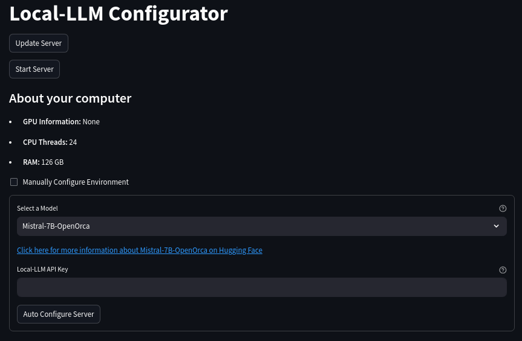
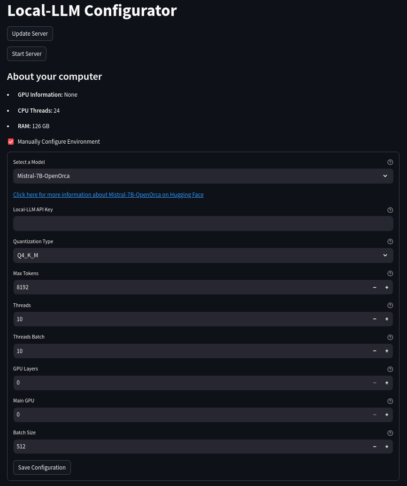

# Local-LLM

- [Dockerhub](https://hub.docker.com/r/joshxt/local-llm/tags)
- [GitHub](https://github.com/Josh-XT/Local-LLM)

Local-LLM is a [llama.cpp](https://github.com/ggerganov/llama.cpp) server in Docker with OpenAI Style Endpoints that allows you to start it with the URL of the model from Hugging Face. It will automatically download the model from Hugging Face and configure the server for you. It also allows you to automatically configure the server based on your CPU, RAM, and GPU. It is designed to be as easy as possible to get started with running local models.

## Table of Contents 📖

- [Local-LLM](#local-llm)
  - [Table of Contents 📖](#table-of-contents-)
  - [Prerequisites](#prerequisites)
  - [Clone the repository](#clone-the-repository)
  - [Local-LLM Configurator UI](#local-llm-configurator-ui)
  - [Run with Docker](#run-with-docker)
    - [CPU Only](#cpu-only)
    - [NVIDIA GPU](#nvidia-gpu)
  - [OpenAI Style Endpoint Usage](#openai-style-endpoint-usage)
    - [Completion](#completion)
    - [Chat Completion](#chat-completion)
    - [Embeddings](#embeddings)
  - [Shout Outs](#shout-outs)

## Prerequisites

- [Git](https://git-scm.com/downloads)
- [Docker](https://docs.docker.com/get-docker/)
- [Docker Compose](https://docs.docker.com/compose/install/)
- [Python 3.10](https://www.python.org/downloads/)
- [NVIDIA Container Toolkit](https://docs.nvidia.com/datacenter/cloud-native/container-toolkit/latest/install-guide.html) (if using NVIDIA GPU)

If using Windows and trying to run locally, it is unsupported, but you will need [Windows Subsystem for Linux](https://docs.microsoft.com/en-us/windows/wsl/install-win10) and [Docker Desktop](https://docs.docker.com/docker-for-windows/install/) at a minimum in addition to the above.

## Clone the repository

```bash
git clone https://github.com/Josh-XT/Local-LLM
cd Local-LLM
```

## Local-LLM Configurator UI

The Local-LLM Configurator UI is a Streamlit app that will automatically set up your environment variables for you based on your CPU, RAM, and GPU. It will also give you the option to manually set up your environment variables if you want to do that instead.  You can choose your desired model from the list pulled from Hugging Face directly and choose to auto configure or [manually configure](ManualSetup.md) your environment variables. This will also determine if you can run the CUDA version of the server or not so that you do not have to worry about it.

The automated configuration script uses `gpt4free` as a free OpenAI `gpt-3.5-turbo` model only to ask it what settings are recommended for your system. It will then set up your `.env` file with the recommended settings. You can skip the manual setup if you use this method.

```bash
pip install -r configurator-requirements.txt --upgrade
streamlit run configurator.py
```





[If you prefer to manually set up your environment variables, check out the manual setup documentation.](ManualSetup.md)

## Run with Docker

### CPU Only

Run with docker:

```bash
docker pull joshxt/local-llm:cpu
docker run -d --name local-llm -p 8091:8091 joshxt/local-llm:cpu --env-file .env
```

Or with docker-compose:

```bash
docker-compose pull
docker-compose up
```

### NVIDIA GPU

If you're using an NVIDIA GPU, you can use the CUDA version of the server.

Run with docker:

```bash
docker pull joshxt/local-llm:cuda
docker run -d --name local-llm -p 8091:8091 --gpus all joshxt/local-llm:cuda --env-file .env
```

Or with docker-compose:

```bash
docker-compose -f docker-compose-cuda.yml pull
docker-compose -f docker-compose-cuda.yml up
```

## OpenAI Style Endpoint Usage

OpenAI Style endpoints available at `http://localhost:8091/` by default. Documentation can be accessed at that url when the server is running.

There are tests for each of the endpoints in the [Tests Jupyter Notebook](tests.ipynb).

**Note, you do not need an OpenAI API Key, this is your own API Key for the server if you defined one.**

### Completion

```python
import openai

openai.api_base = "http://localhost:8091/v1"
openai.api_key = "YOUR API KEY IF YOU SET ONE IN THE .env FILE"
prompt = "Tell me something funny about llamas."

response = openai.Completion.create(
    engine="Local-LLM",
    prompt=prompt,
    temperature=1.31,
    max_tokens=8192,
    top_p=1.0,
    frequency_penalty=0,
    presence_penalty=0,
    stream=False,
)
message = response.choices[0].text.strip()
print(message)
```

### Chat Completion

```python
import openai

openai.api_base = "http://localhost:8091/v1"
openai.api_key = "YOUR API KEY IF YOU SET ONE IN THE .env FILE"
prompt = "Tell me something funny about llamas."
messages = [{"role": "system", "content": prompt}]

response = openai.ChatCompletion.create(
    model="Local-LLM",
    messages=messages,
    temperature=1.31,
    max_tokens=8192,
    top_p=1.0,
    n=1,
    stream=False,
)
message = response.choices[0].message.content.strip()
print(message)
```

### Embeddings

The embeddings endpoint is uses an ONNX embedder with 256 max tokens.

```python
import openai

openai.api_base = "http://localhost:8091/v1"
openai.api_key = "YOUR API KEY IF YOU SET ONE IN THE .env FILE"
prompt = "Tell me something funny about llamas."

response = openai.Embedding.create(
    input=prompt,
    engine="Local-LLM",
)
print(response)
```

## Shout Outs

- [llama.cpp](https://github.com/ggerganov/llama.cpp) - For constantly improving the ability for anyone to run local models. It is one of my favorite and most exciting projects on GitHub.
- [TheBloke](https://huggingface.co/TheBloke) - For helping enable the ability to run local models by quantizing them and sharing them with a great readme on how to use them in every repository.
- [GPT4Free](https://github.com/xtekky/gpt4free) - For keeping this service available to generate text with great models for free.
- [Meta](https://meta.com) - For the absolutely earth shattering open source releases of the LLaMa models and all other contributions they have made to Open Source.
- [OpenAI](https://openai.com/) - For setting good standards for endpoints and making great models.
- As much as I hate to do it, I can't list all of the amazing people building and fine tuning local models, but you know who you are. Thank you for all of your hard work and contributions to the community!
