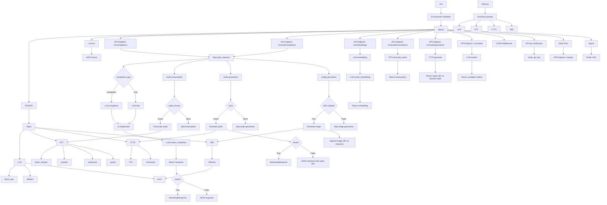

# ezlocalai

[](https://github.com/DevXT-LLC/ezlocalai) [](https://hub.docker.com/r/joshxt/ezlocalai)

ezlocalai is an easy set up artificial intelligence server that allows you to easily run multimodal artificial intelligence from your computer. It is designed to be as easy as possible to get started with running local models. It automatically handles downloading the model of your choice and configuring the server based on your CPU, RAM, and GPU specifications. It also includes [OpenAI Style](https://pypi.org/project/openai/) endpoints for easy integration with other applications using ezlocalai as an OpenAI API proxy with any model. Additional functionality is built in for voice cloning text to speech and a voice to text for easy voice communication as well as image generation entirely offline after the initial setup.

## Prerequisites

- [Git](https://git-scm.com/downloads)
- [Docker Desktop](https://docs.docker.com/docker-for-windows/install/) (Windows or Mac)
- [CUDA Toolkit](https://developer.nvidia.com/cuda-downloads) (NVIDIA GPU only)

<details>
  <summary>Additional Linux Prerequisites</summary>

- [Docker](https://docs.docker.com/get-docker/)
- [Docker Compose](https://docs.docker.com/compose/install/)
- [NVIDIA Container Toolkit](https://docs.nvidia.com/datacenter/cloud-native/container-toolkit/latest/install-guide.html) (NVIDIA GPU only)

</details>

## Installation

```bash
git clone https://github.com/DevXT-LLC/ezlocalai
cd ezlocalai
```

### Environment Setup

Expand Environment Setup if you would like to modify the default environment variables, otherwise skip to Usage. All environment variables are optional and have useful defaults. Change the default model that starts with ezlocalai in your `.env` file.

<details>
  <summary>Environment Setup (Optional)</summary>

None of the values need modified in order to run the server. If you are using an NVIDIA GPU, I would recommend setting the `GPU_LAYERS` and `MAIN_GPU` environment variables. If you plan to expose the server to the internet, I would recommend setting the `EZLOCALAI_API_KEY` environment variable for security. `THREADS` is set to your CPU thread count minus 2 by default, if this causes significant performance issues, consider setting the `THREADS` environment variable manually to a lower number.

Modify the `.env` file to your desired settings. Assumptions will be made on all of these values if you choose to accept the defaults.

Replace the environment variables with your desired settings. Assumptions will be made on all of these values if you choose to accept the defaults.

- `EZLOCALAI_URL` - The URL to use for the server. Default is `http://localhost:8091`.
- `EZLOCALAI_API_KEY` - The API key to use for the server. If not set, the server will not require an API key when accepting requests.
- `NGROK_TOKEN` - The ngrok token to use for the server. If not set, ngrok will not be used. Using ngrok will allow you to expose your ezlocalai server to the public with as simple as an API key. [Get your free NGROK_TOKEN here.](https://dashboard.ngrok.com/get-started/your-authtoken)
- `DEFAULT_MODEL` - The default model to use when no model is specified. Use the Hugging Face path. Default is `TheBloke/phi-2-dpo-GGUF`.
- `LLM_MAX_TOKENS` - The maximum number of tokens to use for the language model. If set to `0`, it will automatically use the max tokens for the model. Default is `0`.
- `WHISPER_MODEL` - The model to use for speech-to-text. Default is `base.en`.
- `AUTO_UPDATE` - Whether or not to automatically update ezlocalai. Default is `true`.
- `THREADS` - The number of CPU threads ezlocalai is allowed to use. Default is 4.
- `GPU_LAYERS` (Only applicable to NVIDIA GPU) - The number of layers to use on the GPU. Default is `0`. Your `GPU_LAYERS` will automatically determine a number of layers to use based on your GPU's memory if it is set to `-1` and you have an NVIDIA GPU. If it is set to `-2`, it will use the maximum number of layers requested by the model.
- `MAIN_GPU` (Only applicable to NVIDIA GPU) - The GPU to use for the language model. Default is `0`.
- `IMG_ENABLED` - If set to true, models will choose to generate images when they want to based on the user input. **This is only available on GPU.** Default is `false`.
- `SD_MODEL` - The stable diffusion model to use. Default is `stabilityai/sdxl-turbo`.
- `VISION_MODEL` - The vision model to use. Default is None. Current options are `deepseek-ai/deepseek-vl-1.3b-chat` and `deepseek-ai/deepseek-vl-7b-chat`.

</details>

## Usage

### NVIDIA GPU

```bash
docker-compose -f docker-compose-cuda.yml down
docker-compose -f docker-compose-cuda.yml build
docker-compose -f docker-compose-cuda.yml up
```

### CPU

```bash
docker-compose down
docker-compose build
docker-compose up
```

## OpenAI Style Endpoint Usage

OpenAI Style endpoints available at `http://<YOUR LOCAL IP ADDRESS>:8091/v1/` by default. Documentation can be accessed at that <http://localhost:8091> when the server is running.

For examples on how to use the server to communicate with the models, see the [Examples Jupyter Notebook](tests/tests.ipynb) once the server is running.

## Demo UI

You can access the basic demo UI at <http://localhost:8502>, or your local IP address with port 8502.

## Workflow


