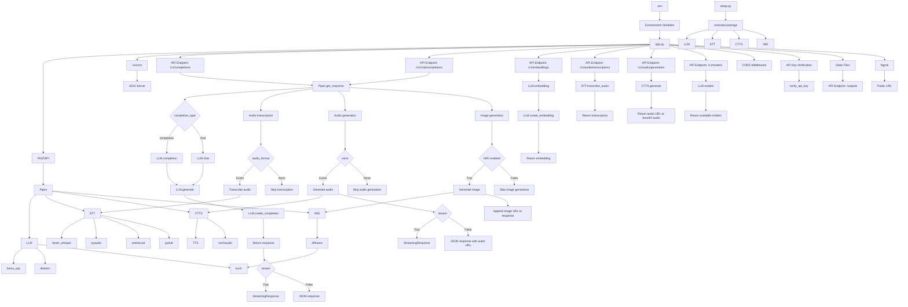

# ezlocalai

[](https://github.com/DevXT-LLC/ezlocalai) [](https://hub.docker.com/r/joshxt/ezlocalai)

ezlocalai is an easy set up artificial intelligence server that allows you to easily run multimodal artificial intelligence from your computer. It is designed to be as easy as possible to get started with running local models. It automatically handles downloading the model of your choice and configuring the server based on your CPU, RAM, and GPU specifications. It also includes [OpenAI Style](https://pypi.org/project/openai/) endpoints for easy integration with other applications using ezlocalai as an OpenAI API proxy with any model. Additional functionality is built in for voice cloning text to speech and a voice to text for easy voice communication as well as image generation entirely offline after the initial setup.

## Prerequisites

- [Python 3.10+](https://www.python.org/downloads/)
- [Docker Desktop](https://docs.docker.com/docker-for-windows/install/) (Windows or Mac)
- [CUDA Toolkit (May Need 12.4)](https://developer.nvidia.com/cuda-12-4-0-download-archive) (NVIDIA GPU only)

<details>
  <summary>Additional Linux Prerequisites</summary>

- [Docker](https://docs.docker.com/get-docker/)
- [Docker Compose](https://docs.docker.com/compose/install/)
- [NVIDIA Container Toolkit](https://docs.nvidia.com/datacenter/cloud-native/container-toolkit/latest/install-guide.html) (NVIDIA GPU only)

</details>

## Quick Start (Recommended)

Install the CLI and start ezlocalai with a single command:

```bash
pip install ezlocalai
ezlocalai start
```

It will take several minutes to download the models on the first run. Once running, access the API at <http://localhost:8091>.

### CLI Commands

```bash
# Start with defaults (auto-detects GPU, uses Qwen3-VL-4B)
ezlocalai start

# Start with a specific model
ezlocalai start --model unsloth/gemma-3-4b-it-GGUF

# Start with custom options
ezlocalai start --model unsloth/Qwen3-VL-4B-Instruct-GGUF \
                --uri http://localhost:8091 \
                --api-key my-secret-key \
                --ngrok <your-ngrok-token>

# Other commands
ezlocalai stop      # Stop the container
ezlocalai restart   # Restart the container
ezlocalai status    # Check if running and show configuration
ezlocalai logs      # Show container logs (use -f to follow)
ezlocalai update    # Pull/rebuild latest images

# Send prompts directly from the CLI
ezlocalai prompt "Hello, world!"
ezlocalai prompt "What's in this image?" -image ./photo.jpg
ezlocalai prompt "Explain quantum computing" -m unsloth/Qwen3-VL-4B-Instruct-GGUF -temp 0.7
```

### CLI Options

| Option | Default | Description |
|--------|---------|-------------|
| `--model`, `-m` | `unsloth/Qwen3-VL-4B-Instruct-GGUF` | HuggingFace GGUF model(s), comma-separated |
| `--uri` | `http://localhost:8091` | Server URL |
| `--api-key` | None | API key for authentication |
| `--ngrok` | None | ngrok token for public URL |

### Prompt Command Options

| Option | Default | Description |
|--------|---------|-------------|
| `-m`, `--model` | Auto-detected | Model to use for the prompt |
| `-temp`, `--temperature` | Model default | Temperature for response generation (0.0-2.0) |
| `-tp`, `--top-p` | Model default | Top-p (nucleus) sampling parameter (0.0-1.0) |
| `-image`, `--image` | None | Path to local image file or URL to include with prompt |
| `-stats`, `--stats` | Off | Show statistics (tokens, speed, timing) after response |

For additional options (Whisper, image model, etc.), edit `~/.ezlocalai/.env`:

### Data Persistence

All data is stored in `~/.ezlocalai/`:

| Directory | Contents |
|-----------|----------|
| `~/.ezlocalai/data/models/` | Downloaded GGUF model files |
| `~/.ezlocalai/data/hf/` | HuggingFace cache |
| `~/.ezlocalai/data/voices/` | Voice cloning samples |
| `~/.ezlocalai/data/outputs/` | Generated images/audio |
| `~/.ezlocalai/.env` | Your configuration |

Models persist across container updates - you won't re-download them when updating the CLI or rebuilding the CUDA image.

## Benchmarks

Performance tested on Intel i9-12900KS + RTX 4090 (24GB):

| Model | Size | Speed | Notes |
|-------|------|-------|-------|
| **Qwen3-VL-4B** | 4B | ~210 tok/s | Vision-capable, great for chat |
| **Qwen3-Coder-30B** | 30B (MoE) | ~65 tok/s | Coding model, hot-swappable |

Both models pre-calibrate at startup and hot-swap in ~1 second.

## OpenAI Style Endpoint Usage

OpenAI Style endpoints available at `http://<YOUR LOCAL IP ADDRESS>:8091/v1/` by default. Documentation can be accessed at that <http://localhost:8091> when the server is running.

```python
import requests

response = requests.post(
    "http://localhost:8091/v1/chat/completions",
    headers={"Authorization": "Bearer your-api-key"},  # Change this if you configured an API key
    json={
        "model": "unsloth/Qwen3-VL-4B-Instruct-GGUF",
        "messages": [
            {
                "role": "user",
                "content": [
                    {"type": "text", "text": "Describe each stage of this image."},
                    {
                        "type": "image_url",
                        "image_url": {
                            "url": "https://www.visualwatermark.com/images/add-text-to-photos/add-text-to-image-3.webp"
                        },
                    },
                ],
            },
        ],
        "max_tokens": 8192,
        "temperature": 0.7,
        "top_p": 0.8,
    },
)
print(response.json()["choices"][0]["message"]["content"])
```

For examples on how to use the server to communicate with the models, see the [Examples Jupyter Notebook](tests.ipynb) once the server is running. We also have an [example to use in Google Colab](ezlocalai-ngrok.ipynb).

## Workflow


