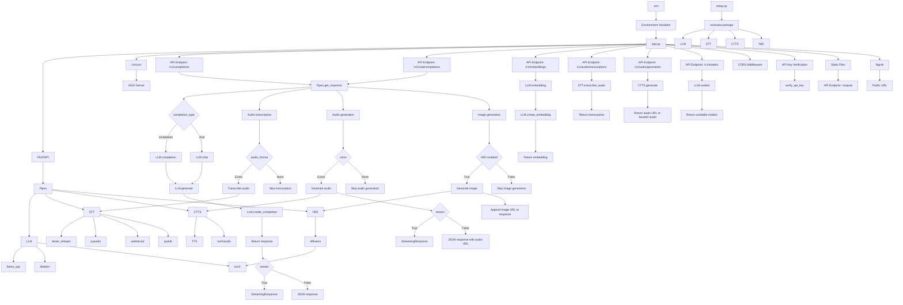

# ezlocalai

[](https://github.com/DevXT-LLC/ezlocalai) [](https://hub.docker.com/r/joshxt/ezlocalai)

ezlocalai is an easy set up artificial intelligence server that allows you to easily run multimodal artificial intelligence from your computer. It is designed to be as easy as possible to get started with running local models. It automatically handles downloading the model of your choice and configuring the server based on your CPU, RAM, and GPU specifications. It also includes [OpenAI Style](https://pypi.org/project/openai/) endpoints for easy integration with other applications using ezlocalai as an OpenAI API proxy with any model. Additional functionality is built in for voice cloning text to speech and a voice to text for easy voice communication as well as image generation entirely offline after the initial setup.

## Prerequisites

> **Note:** If using the CLI (`pip install ezlocalai`), prerequisites are auto-installed on Linux. Skip to [Quick Start](#quick-start-recommended).

- [Git](https://git-scm.com/downloads)
- [Docker Desktop](https://docs.docker.com/docker-for-windows/install/) (Windows or Mac)
- [CUDA Toolkit (May Need 12.4)](https://developer.nvidia.com/cuda-12-4-0-download-archive) (NVIDIA GPU only)

<details>
  <summary>Additional Linux Prerequisites</summary>

- [Docker](https://docs.docker.com/get-docker/)
- [Docker Compose](https://docs.docker.com/compose/install/)
- [NVIDIA Container Toolkit](https://docs.nvidia.com/datacenter/cloud-native/container-toolkit/latest/install-guide.html) (NVIDIA GPU only)

</details>

## Quick Start (Recommended)

Install the CLI and start ezlocalai with a single command:

```bash
pip install ezlocalai
ezlocalai start
```

That's it! The CLI will:
- Auto-detect your GPU (NVIDIA) or fall back to CPU mode
- Install Docker if not present (Linux only)
- Install NVIDIA Container Toolkit if needed (Linux only)
- Pull and start the appropriate container
- Download models automatically on first run

### CLI Commands

```bash
# Start with defaults (auto-detects GPU, uses Qwen3-VL-4B)
ezlocalai start

# Start with a specific model
ezlocalai start --model unsloth/gemma-3-4b-it-GGUF

# Start with custom options
ezlocalai start --model unsloth/Qwen3-VL-4B-Instruct-GGUF \
                --uri http://localhost:8091 \
                --api-key my-secret-key \
                --ngrok <your-ngrok-token>

# Other commands
ezlocalai stop      # Stop the container
ezlocalai restart   # Restart the container
ezlocalai status    # Check if running and show configuration
ezlocalai logs      # Show container logs (use -f to follow)
ezlocalai update    # Pull/rebuild latest images
```

### Data Persistence

All data is stored in `~/.ezlocalai/`:

| Directory | Contents |
|-----------|----------|
| `~/.ezlocalai/data/models/` | Downloaded GGUF model files |
| `~/.ezlocalai/data/hf/` | HuggingFace cache |
| `~/.ezlocalai/data/voices/` | Voice cloning samples |
| `~/.ezlocalai/data/outputs/` | Generated images/audio |
| `~/.ezlocalai/.env` | Your configuration |

Models persist across container updates - you won't re-download them when updating the CLI or rebuilding the CUDA image.

### CLI Options

| Option | Default | Description |
|--------|---------|-------------|
| `--model`, `-m` | `unsloth/Qwen3-VL-4B-Instruct-GGUF` | HuggingFace GGUF model(s), comma-separated |
| `--uri` | `http://localhost:8091` | Server URL |
| `--api-key` | None | API key for authentication |
| `--ngrok` | None | ngrok token for public URL |

For additional options (Whisper, image model, etc.), edit `~/.ezlocalai/.env`:

```bash
# Example .env configuration
DEFAULT_MODEL="unsloth/Qwen3-VL-4B-Instruct-GGUF"
WHISPER_MODEL="base"           # Speech-to-text (empty to disable)
IMG_MODEL=""                   # Image generation (empty to disable)
EZLOCALAI_API_KEY=""           # API authentication
```

---

## Manual Installation

If you prefer manual setup or need more control:

```bash
git clone https://github.com/DevXT-LLC/ezlocalai
cd ezlocalai
```

### Environment Setup

Expand Environment Setup if you would like to modify the default environment variables, otherwise skip to Usage. All environment variables are optional and have useful defaults. Change the default model that starts with ezlocalai in your `.env` file.

<details>
  <summary>Environment Setup (Optional)</summary>

None of the values need modified in order to run the server. If you are using an NVIDIA GPU, I would recommend setting the `GPU_LAYERS` and `MAIN_GPU` environment variables. If you have multiple GPUs, especially different ones, you should set `TENSOR_SPLIT` to reflect the desired load balance (comma separated decimals totalling 1). If you plan to expose the server to the internet, I would recommend setting the `EZLOCALAI_API_KEY` environment variable for security. `THREADS` is set to your CPU thread count minus 2 by default, if this causes significant performance issues, consider setting the `THREADS` environment variable manually to a lower number.

Modify the `.env` file to your desired settings. Assumptions will be made on all of these values if you choose to accept the defaults.

Replace the environment variables with your desired settings. Assumptions will be made on all of these values if you choose to accept the defaults.

- `EZLOCALAI_URL` - The URL to use for the server. Default is `http://localhost:8091`.
- `EZLOCALAI_API_KEY` - The API key to use for the server. If not set, the server will not require an API key when accepting requests.
- `NGROK_TOKEN` - The ngrok token to use for the server. If not set, ngrok will not be used. Using ngrok will allow you to expose your ezlocalai server to the public with as simple as an API key. [Get your free NGROK_TOKEN here.](https://dashboard.ngrok.com/get-started/your-authtoken)
- `DEFAULT_MODEL` - The default model(s) to load. Comma-separated list of HuggingFace model paths. First model loads at startup, others swap on demand. Default is `unsloth/Qwen3-VL-4B-Instruct-GGUF`.
- `WHISPER_MODEL` - The model to use for speech-to-text. Default is `base.en`.
- `AUTO_UPDATE` - Whether or not to automatically update ezlocalai. Default is `true`.
- `THREADS` - The number of CPU threads ezlocalai is allowed to use. Default is 4.
- `MAIN_GPU` (Only applicable to NVIDIA GPU) - The GPU to use for the language model. Default is `0`.
- `TENSOR_SPLIT` (Only applicable with multiple CUDA GPUs) - The allocation to each device in CSV format.
- `IMG_MODEL` - The image generation model to use. Leave empty to disable image generation. Example: `ByteDance/SDXL-Lightning`.

**Auto-configured (no env vars needed):**
- **VRAM Budget** - Automatically detected from GPU
- **GPU Layers** - Auto-calibrated based on VRAM budget
- **Context Size** - Dynamic, rounds up to nearest 32k based on prompt size
- **Image Device** - Auto-detects CUDA availability
- **Vision** - Handled by main LLM if it has mmproj (e.g., Qwen3-VL models)

</details>

## Usage

### NVIDIA GPU

```bash
docker-compose -f docker-compose-cuda.yml down
docker-compose -f docker-compose-cuda.yml build
docker-compose -f docker-compose-cuda.yml up
```

### CPU

```bash
docker-compose down
docker-compose build
docker-compose up
```

## Benchmarks

Performance tested on Intel i9-12900KS + RTX 4090 (24GB):

| Model | Size | Speed | Notes |
|-------|------|-------|-------|
| **Qwen3-VL-4B** | 4B | ~210 tok/s | Vision-capable, great for chat |
| **Qwen3-Coder-30B** | 30B (MoE) | ~65 tok/s | Coding model, hot-swappable |

Both models pre-calibrate at startup and hot-swap in ~1 second.

## OpenAI Style Endpoint Usage

OpenAI Style endpoints available at `http://<YOUR LOCAL IP ADDRESS>:8091/v1/` by default. Documentation can be accessed at that <http://localhost:8091> when the server is running.

For examples on how to use the server to communicate with the models, see the [Examples Jupyter Notebook](tests.ipynb) once the server is running. We also have an [example to use in Google Colab](ezlocalai-ngrok.ipynb).

## Demo UI

You can access the basic demo UI at <http://localhost:8502>, or your local IP address with port 8502.

## Workflow


