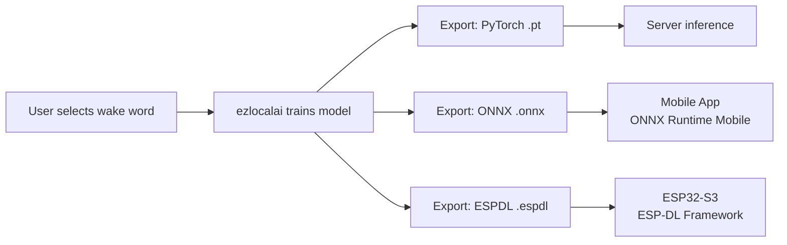
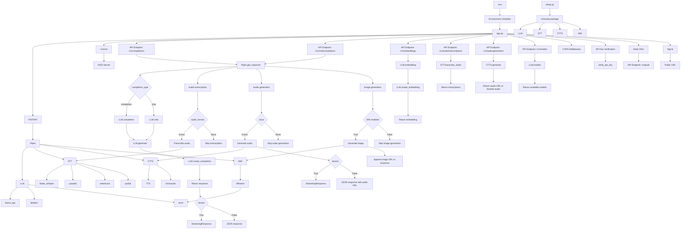

# ezlocalai

[](https://github.com/DevXT-LLC/ezlocalai) [](https://hub.docker.com/r/joshxt/ezlocalai)

ezlocalai is an easy set up artificial intelligence server that allows you to easily run multimodal artificial intelligence from your computer. It is designed to be as easy as possible to get started with running local models. It automatically handles downloading the model of your choice and configuring the server based on your CPU, RAM, and GPU specifications. It also includes [OpenAI Style](https://pypi.org/project/openai/) endpoints for easy integration with other applications using ezlocalai as an OpenAI API proxy with any model. Additional functionality is built in for voice cloning text to speech and a voice to text for easy voice communication as well as image generation and video generation entirely offline after the initial setup.

## Prerequisites

- [Python 3.10+](https://www.python.org/downloads/)
- [Docker Desktop](https://docs.docker.com/docker-for-windows/install/) (Windows or Mac)
- [CUDA Toolkit (May Need 12.4)](https://developer.nvidia.com/cuda-12-4-0-download-archive) (NVIDIA GPU only)
- [ROCm](https://rocm.docs.amd.com/projects/install-on-linux/en/latest/index.html) (AMD GPU only - Linux)

<details>
  <summary>Additional Linux Prerequisites</summary>

- [Docker](https://docs.docker.com/get-docker/)
- [Docker Compose](https://docs.docker.com/compose/install/)
- [NVIDIA Container Toolkit](https://docs.nvidia.com/datacenter/cloud-native/container-toolkit/latest/install-guide.html) (NVIDIA GPU only)
- [ROCm](https://rocm.docs.amd.com/projects/install-on-linux/en/latest/index.html) (AMD GPU only - Radeon RX 6000/7000/9000 series, Radeon PRO, and Ryzen APUs)

</details>

## Quick Start (Recommended)

Install the CLI and start ezlocalai with a single command:

```bash
pip install ezlocalai
ezlocalai start
```

It will take several minutes to download the models on the first run. Once running, access the API at <http://localhost:8091>.

### CLI Commands

```bash
# Start with defaults (auto-detects GPU, uses Qwen3-VL-4B)
ezlocalai start

# Start with a specific model
ezlocalai start --model unsloth/gemma-3-4b-it-GGUF

# Start with custom options
ezlocalai start --model unsloth/Qwen3-VL-4B-Instruct-GGUF \
                --uri http://localhost:8091 \
                --api-key my-secret-key \
                --ngrok <your-ngrok-token>

# Other commands
ezlocalai stop      # Stop the container
ezlocalai restart   # Restart the container
ezlocalai status    # Check if running and show configuration
ezlocalai logs      # Show container logs (use -f to follow)
ezlocalai update    # Pull/rebuild latest images

# Send prompts directly from the CLI
ezlocalai prompt "Hello, world!"
ezlocalai prompt "What's in this image?" -image ./photo.jpg
ezlocalai prompt "Explain quantum computing" -m unsloth/Qwen3-VL-4B-Instruct-GGUF -temp 0.7
```

### CLI Options

| Option | Default | Description |
|--------|---------|-------------|
| `--model`, `-m` | `unsloth/Qwen3-VL-4B-Instruct-GGUF` | HuggingFace GGUF model(s), comma-separated |
| `--uri` | `http://localhost:8091` | Server URL |
| `--api-key` | None | API key for authentication |
| `--ngrok` | None | ngrok token for public URL |

### Prompt Command Options

| Option | Default | Description |
|--------|---------|-------------|
| `-m`, `--model` | Auto-detected | Model to use for the prompt |
| `-temp`, `--temperature` | Model default | Temperature for response generation (0.0-2.0) |
| `-tp`, `--top-p` | Model default | Top-p (nucleus) sampling parameter (0.0-1.0) |
| `-image`, `--image` | None | Path to local image file or URL to include with prompt |
| `-stats`, `--stats` | Off | Show statistics (tokens, speed, timing) after response |

For additional options (Whisper, image model, etc.), edit `~/.ezlocalai/.env`:

### Data Persistence

All data is stored in `~/.ezlocalai/`:

| Directory | Contents |
|-----------|----------|
| `~/.ezlocalai/data/models/` | Downloaded GGUF model files |
| `~/.ezlocalai/data/hf/` | HuggingFace cache |
| `~/.ezlocalai/data/voices/` | Voice cloning samples |
| `~/.ezlocalai/data/outputs/` | Generated images/audio |
| `~/.ezlocalai/.env` | Your configuration |

Models persist across container updates - you won't re-download them when updating the CLI or rebuilding the CUDA image.

## Benchmarks

Performance tested on Intel i9-12900KS + RTX 4090 (24GB):

| Model | Size | Speed | Notes |
|-------|------|-------|-------|
| **Qwen3-VL-4B** | 4B | ~210 tok/s | Vision-capable, great for chat |
| **Qwen3-Coder-30B** | 30B (MoE) | ~65 tok/s | Coding model, hot-swappable |

Both models pre-calibrate at startup and hot-swap in ~1 second.

## Distributed Fallback / Multi-Machine Setup

ezlocalai supports a distributed fallback system where multiple instances can fall back to each other when local resources (VRAM/RAM) are exhausted, or fall back to any OpenAI-compatible API. This enables:

- **Load balancing**: When one machine is busy, requests automatically route to another
- **Redundancy**: If one server is overloaded, the fallback handles requests
- **Resource optimization**: Each machine handles what it can, forwarding the rest
- **Hybrid deployment**: Mix local ezlocalai instances with cloud APIs

### Configuration

Set these environment variables in your `.env` file or pass them to the container:

```bash
# Fallback server URL - can be another ezlocalai instance OR any OpenAI-compatible API
FALLBACK_SERVER=http://192.168.1.100:8091  # Another ezlocalai instance
# Or use a cloud provider:
# FALLBACK_SERVER=https://api.openai.com/v1

# Authentication for the fallback server
FALLBACK_API_KEY=your-api-key

# Optional: Override model for OpenAI-compatible fallback (pass-through by default)
# If not set, the originally requested model is passed through to the fallback server
# FALLBACK_MODEL=gpt-4o-mini

# Combined memory threshold (VRAM + RAM) in GB - fallback triggers when below this
# Models can offload to system RAM, so combined memory is more accurate than VRAM alone
FALLBACK_MEMORY_THRESHOLD=8.0
```

The system automatically detects whether `FALLBACK_SERVER` points to another ezlocalai instance or an OpenAI-compatible API by checking for the `/v1/resources` endpoint. If it's another ezlocalai server, full endpoint forwarding is used (preserving the original request). Otherwise, it falls back to standard OpenAI API calls, passing through the originally requested model (or using `FALLBACK_MODEL` if set as an override).

### Example: Two-Machine Setup

**Machine A** (Primary with RTX 4090):
```bash
EZLOCALAI_URL=http://0.0.0.0:8091
EZLOCALAI_API_KEY=shared-key
FALLBACK_SERVER=http://machine-b:8091
FALLBACK_API_KEY=shared-key
```

**Machine B** (Fallback with RTX 3080):
```bash
EZLOCALAI_URL=http://0.0.0.0:8091
EZLOCALAI_API_KEY=shared-key
FALLBACK_SERVER=http://machine-a:8091
FALLBACK_API_KEY=shared-key
```

Both machines fall back to each other - creating a resilient two-node cluster.

### Example: Local + Cloud Hybrid

Run a local ezlocalai with OpenAI as the fallback:

```bash
EZLOCALAI_URL=http://0.0.0.0:8091
FALLBACK_SERVER=https://api.openai.com/v1
FALLBACK_API_KEY=sk-your-openai-key
FALLBACK_MODEL=gpt-4o-mini
```

### Monitoring Fallback Status

Check the fallback status via API:
```bash
# Get resource status including fallback info
curl http://localhost:8091/v1/resources

# Check fallback availability and models
curl http://localhost:8091/v1/fallback/status
```

### What Gets Forwarded

When fallback is triggered to another ezlocalai instance, these endpoints are automatically forwarded:
- `/v1/chat/completions` - Chat completions (including streaming)
- `/v1/completions` - Text completions
- `/v1/embeddings` - Text embeddings
- `/v1/audio/transcriptions` - Speech-to-text
- `/v1/audio/speech` - Text-to-speech
- `/v1/audio/music` - Music generation
- `/v1/images/generations` - Image generation
- `/v1/images/edits` - Image editing (image + text to image)
- `/v1/videos/generations` - Video generation

For OpenAI-compatible APIs, only chat completions and embeddings are forwarded.

## On-Demand LLM Residency

`DEFAULT_MODEL` accepts a comma-separated model list. With
`LLM_MODEL_RESIDENCY=auto`, ezlocalai estimates each configured model's GPU
footprint at startup. Models remain resident together when they fit; when models
assigned to the same GPU exceed its usable VRAM, only the first model is loaded
at startup. Requesting another configured model unloads the idle resident model,
loads the requested model, and leaves it resident until a different model is
requested.

```bash
DEFAULT_MODEL=unsloth/Qwen3.8-27B-GGUF,unsloth/Qwen3.6-35B-A3B-MTP-GGUF
LLM_MODEL_RESIDENCY=auto
LLM_MODEL_RESIDENCY_MARGIN_GB=1.5
```

Use `LLM_MODEL_RESIDENCY=resident` to force all configured models to load
together or `LLM_MODEL_RESIDENCY=swap` to force one-at-a-time loading. Swap mode
serializes local text work so an active model is never unloaded mid-generation.
The worker continues to advertise every configured model, but its heartbeat
marks all swap-dependent model slots occupied while the resident model is in
use.

Model-only load/unload timings are exposed under `model_lifecycle` in
`GET /v1/resources`. To alternate configured models and print those timings:

```bash
python benchmark_model_lifecycle.py \
  --models unsloth/Qwen3.8-27B-GGUF,unsloth/Qwen3.6-35B-A3B-MTP-GGUF \
  --rounds 2
```

## Qwen3.8-27B Performance Tuning

Qwen3.8-27B automatically uses **MTP**, through xllamacpp 2026.9.10809,
with one inference slot, three draft tokens and a 0.1 draft probability threshold.
DFlash2 remains opt-in with `LLM_SPECULATIVE_TYPE=dflash2`; only that backend
downloads the revision-pinned
[Inco Q4_K_M draft](https://huggingface.co/incoai/Qwen3.8-27B-DFlash2-GGUF)
(about 1.1 GB of weights, plus its runtime buffers) into the shared HF cache.
The target model and sampling settings are unchanged: draft tokens are verified
by the target, not accepted unconditionally. Physical prompt batches are
hardware- and context-aware: 24 GB cards use an ubatch of 1024 through 200K
context and 512 above 200K, while 32 GB cards use 1024. Other MTP model
families retain their conservative defaults.

The CUDA image includes a pinned native hotfix for DFlash's large-image cache
exhaustion (`failed to process mtmd chunk`). It preserves full-resolution target
vision input without enlarging the KV cache. See [hotfix details and native build
instructions](native/patches/README.md). Verify a deployed CUDA worker with:

```bash
docker exec ezlocalai python -c 'from xllamacpp._ezlocalai_hotfix import HOTFIX; print(HOTFIX)'
```

It should report `dflash-pinned-image-positions-v1`. The upstream version number
alone does not identify the patched build. Test an idle worker's vision stream
with `python benchmark_vision.py --url http://localhost:8091 --stream` (set
`EZLOCALAI_API_KEY` if authentication is enabled).

All values remain operator-overridable:

```bash
LLM_SPECULATIVE_TYPE=auto  # auto, dflash2, mtp, none
MTP_SPEC_DRAFT_N_MAX=auto  # Qwen3.8-27B: 3 on all three card families
MTP_SPEC_DRAFT_P_MIN=auto  # Qwen3.8-27B: 0.1
KV_CACHE_TYPE=auto        # q4_0; q8_0 remains an explicit precision opt-in
DFLASH_SPEC_DRAFT_N_MAX=auto  # 3090: 3; 4090/5090: 4; explicit 1..7 overrides
DFLASH_SPEC_DRAFT_P_MIN=0.0
LLM_BATCH_SIZE=auto
LLM_UBATCH_SIZE=auto
```

GPU-aware defaults for Qwen3.8-27B (explicit settings take precedence):

| Worker GPU | MTP draft maximum | MTP p-min | Target K/V cache |
| --- | --- | --- | --- |
| RTX 3090 / 3090 Ti | 3 | 0.1 | q4_0 |
| RTX 4090 | 3 | 0.1 | q4_0 |
| RTX 5090 | 3 | 0.1 | q4_0 |

These are starting profiles, not measured optima for every workload. To tune a
mixed fleet from one configuration, use card-specific overrides such as
`MTP_SPEC_DRAFT_N_MAX_3090=3`, `MTP_SPEC_DRAFT_N_MAX_5090=4`, or
`KV_CACHE_TYPE_5090=q8_0`. Card-specific overrides beat global overrides.
`KV_CACHE_TYPE=auto` selects the table; an existing explicit
`KV_CACHE_TYPE=q4_0` still keeps Q4 on every card unless overridden per card.
Other model families and GPU types retain Q4 by default; Jetson keeps its
explicit F16 setting. The memory planner uses the resolved cache precision.
The [local Q3 / 3090 Ti comparison](benchmarks/qwen38-3090ti-20260908.md)
found mixed DFlash gains, including regressions on short thinking requests.
The MTP three-token baseline is shared across cards; higher values on the
4090/5090 require on-card validation, not extrapolation from free VRAM.
Batch/ubatch remain hardware- and context-aware as described above; explicit
operator values are preserved.

Deployment: remove an explicit `LLM_SPECULATIVE_TYPE=dflash2` override or set it
to `auto`/`mtp`, then rebuild/restart each worker. Explicit `MTP_SPEC_DRAFT_*`
and `KV_CACHE_TYPE*` values still win; set them to `auto` (or remove them) to
adopt these defaults. The router does not choose the native decoding backend.
DFlash's optional starting lengths remain 3 on 3090 and 4 on 4090/5090.

For this 27B model, target KV at 262,144 tokens is approximately 4.5 GiB with
Q4 versus 8.5 GiB with Q8 (excluding recurrent state, weights, draft and compute
buffers). Q8 therefore needs about 4 GiB extra. It is a precision upgrade, not
a guaranteed speed improvement. Keep Q4 on 24 GB cards at long context. A
smaller main-model quant also does not guarantee faster prefill or decode:
kernel choice, acceptance, cache traffic and prompt content matter.

An isolated sweep on an idle worker can be run with:

```bash
python benchmark_speculative.py --context 220000 --tokens 256 \
  --draft-lengths 3,4,5,7 --prompt-chars 0,120000,360000 --repeats 2 \
  --kv-cache q4_0
```

The sweep includes no-speculation and MTP controls, real code prefixes, actual
prompt-token counts, prefill/decode timing, and greedy output hashes. Use the
same immutable `--prompt-file` for all runs/cards. Allocated context alone is
not a long-context benchmark: compare actual prompt lengths. Do not run this
alongside the resident server on the same GPU. Greedy hash checks are a smoke
test, not a proof of quality or of production-sampling throughput.
Use `--sampling-profile thinking` or `--sampling-profile instruct` for the
actual ezlocalai sampling settings; non-greedy runs do not compare output hashes.
For a focused follow-up, `--backends mtp,dflash2` skips the no-speculation control.

Single-GPU NVIDIA workers can also A/B test llama.cpp's experimental concurrent
CUDA-stream optimization with `GGML_CUDA_GRAPH_OPT=1`. It primarily targets
token-generation throughput rather than prompt processing. Results vary by GPU
and model, so leave it disabled unless a representative decode benchmark shows
a repeatable improvement.

Existing `MTP_SPEC_DRAFT_*` settings apply only with the MTP backend; they do
not tune DFlash2. Set `LLM_SPECULATIVE_TYPE=dflash2` for an A/B comparison or `none`
to disable speculation. Other model families never receive the 27B draft.
`DFLASH_MODEL_FILE` selects another quant from the same pinned repository;
`DFLASH_MODEL_PATH` can point to an already downloaded compatible draft.

Benchmark representative prompts on each card: more speculation is not always
faster, and a draft that forces target layers onto CPU can erase the benefit.
Explicit `LLM_UBATCH_SIZE`
values are attempted first; the resilient loader retries smaller physical
batches if model initialization runs out of GPU memory.

## Qwen TTS with llama.cpp

Local Qwen TTS now uses a persistent, private stdio worker built against the
same llama.cpp revision as xllamacpp. It uses upstream libmtmd for the speaker
encoder, talker, code predictor and vocoder. Standard images no longer install
`qwen-tts` or its dedicated FlashAttention wheel. Torch/Transformers remain
dependencies of other media models; they are not used for TTS synthesis.

The default retains the **Qwen3-TTS-12Hz-0.6B-Base** model, using the
[llama.cpp-compatible Q8_0 talker and F16 codec conversion](https://huggingface.co/Mouserat/qwen3-tts-0.6b-base-gguf).
The old `QWEN_TTS_MODEL=Qwen/Qwen3-TTS-12Hz-0.6B-Base` value is migrated
automatically. This is a backend/quantization change, not a claim of identical
audio or verified perceptual-quality parity with the old implementation.

Voice `.wav` references, WAV responses, chunked PCM streaming, audio caching,
and the existing voice/LLM slot-sharing policy are preserved. The native worker
stays loaded between chunks and `close()` waits for process exit before the
LLM can reclaim the slot. **Cloning is audio-only (x-vector)**: `.txt`
transcripts are preserved on disk but no longer condition generation.
`auto` language uses script detection for Russian, Chinese, Japanese and Korean,
otherwise English; specify the language explicitly for other supported languages
(German, Italian, Portuguese, Spanish and French). Mixed-language synthesis
should be checked on your actual voice samples.

```bash
QWEN_TTS_MODEL=Mouserat/qwen3-tts-0.6b-base-gguf
QWEN_TTS_CONTEXT_SIZE=4096
QWEN_TTS_THREADS=20
QWEN_TTS_TIMEOUT=300
QWEN_TTS_MAX_NEW_TOKENS=320  # audio frames, not text tokens
```

`QWEN_TTS_MODEL_FILE` and `QWEN_TTS_MMPROJ_FILE` accept filenames in a custom
GGUF repository or local file paths; both files must be compatible with upstream
libmtmd. `QWEN_TTS_REVISION` pins a custom repository revision. The old dtype,
attention, transcript and non-streaming settings do not control the native model.
`QWEN_TTS_GENERATE_KWARGS` supports `max_new_tokens`, `temperature`, `top_k`,
`top_p` and `repetition_penalty`; unsupported options fail explicitly.

CUDA images build kernels for 3090/4090/5090 (SM 86/89/120). Native installs
need CMake, a C++ compiler, and the CUDA toolkit for GPU synthesis:

```bash
python scripts/build_tts.py --cuda --build-dir /absolute/path/tts-build
export QWEN_TTS_BIN=/absolute/path/tts-build/bin/ezlocalai-tts
```

Omit `--cuda` for a CPU build. Model download happens during precache without
loading a GPU model. Changing the backend uses a new audio-cache namespace.

## Embeddings

ezlocalai serves `/v1/embeddings` with a dedicated GGUF embedding model, independent
of `TEXT_SERVER`. By default it uses Qwen3-Embedding-0.6B Q8_0 with a 32k context:

```bash
EMBEDDING_ENABLED=true
EMBEDDING_MODEL=Qwen/Qwen3-Embedding-0.6B-GGUF
EMBEDDING_MODEL_ALIAS=Qwen3-Embedding-0.6B
EMBEDDING_QUANT_TYPE=Q8_0
EMBEDDING_CONTEXT_LENGTH=8192
EMBEDDING_N_PARALLEL=1
EMBEDDING_GPU_LAYERS=auto
EMBEDDING_KV_CACHE_TYPE=f16
```

When using the router, workers advertise the `embedding` capability only when
`EMBEDDING_ENABLED=true`, so embedding requests route to workers that can serve
them and the dashboard shows the active embedding model. `EMBEDDING_N_PARALLEL`
controls how many full-context embedding model instances are loaded and reported
to the router; each instance keeps the full `EMBEDDING_CONTEXT_LENGTH` per request
instead of splitting the context across internal xllamacpp slots. With
`EMBEDDING_GPU_LAYERS=auto`, ezlocalai estimates the 32k embedding cache footprint
for each instance and partially offloads layers to CPU when VRAM is tight.

## Image And Video

Image and video workers are opt-in so setting `IMG_MODEL` or `VIDEO_MODEL` alone
does not warm-load or advertise those capabilities:

```bash
IMAGE_ENABLED=false
IMG_MODEL=
VIDEO_ENABLED=false
VIDEO_MODEL=unsloth/LTX-2.3-GGUF
```

Set `IMAGE_ENABLED=true` with `IMG_MODEL` to serve local image generation, or
`VIDEO_ENABLED=true` to serve local video generation. When `VIDEO_MODEL` is
omitted or blank, ezlocalai defaults to `unsloth/LTX-2.3-GGUF`. Enabled media
models report `image` or `video` capacity to the router. They warm-load and stay
resident when enough GPU headroom is available; on single-GPU LLM workers, image
and video models can lazy-load after an LLM handoff so their pipelines initialize
with freed VRAM. Workers
with an `IMAGE_SERVER` URL configured still delegate media requests instead of
loading local models.

For image generation, the default handoff policy is:

```bash
IMAGE_UNLOAD_LLM_DURING_GENERATION=auto
IMAGE_RELOAD_LLM_AFTER_GENERATION=true
IMAGE_WAIT_FOR_LLM_IDLE_TIMEOUT=60
IMAGE_MODEL_MIN_FREE_GB=6
```

In `auto` mode, a single-GPU worker keeps FLUX beside the LLM when there is enough
free VRAM. Otherwise it waits for active LLM inference to finish, marks text and
vision temporarily unavailable, unloads the LLM and idle auxiliary GPU models,
loads FLUX, generates the image, unloads FLUX, and restores the exact LLM
residency that existed before the handoff.

On a single-GPU worker, leave `VIDEO_UNLOAD_LLM_DURING_GENERATION=auto`. When a
resident LLM is occupying the only GPU, ezlocalai marks the text/vision slots
temporarily unavailable, unloads the LLM plus idle aux GPU models, initializes
LTX-2.3 with the freed VRAM, runs generation, unloads video if needed, and
reloads persistent LLMs when `VIDEO_RELOAD_LLM_AFTER_GENERATION=true`.
`VIDEO_GPU_RESIDENCY=auto` chooses full GPU residency only on very large GPUs,
model CPU offload when enough VRAM was freed for the requested clip size, and
sequential CPU offload as the constrained fallback for long scenes. Short clips
can use model offload when at least `VIDEO_SHORT_MODEL_OFFLOAD_MIN_FREE_GB`
remains after LTX loads; longer scenes stay sequential unless
`VIDEO_MODEL_OFFLOAD_MIN_FREE_GB`/`VIDEO_FULL_GPU_MIN_FREE_GB` say the GPU has
room. If a more aggressive mode OOMs,
`VIDEO_RETRY_SEQUENTIAL_ON_OOM=true` reloads LTX with sequential offload and
retries once. Set `VIDEO_GPU_RESIDENCY=full` to force a full-GPU attempt.

LTX-2.3 requires dimensions divisible by 32 and frame counts in the `8n+1`
pattern. The music-video helper handles frame planning automatically.

## Music Generation

ezlocalai serves `/v1/audio/music` and `/v1/audio/music/generations` by
starting an internal ACE-Step 1.5 `acestep.cpp` server inside the same Docker
container. The GGUF model files are downloaded from
`Serveurperso/ACE-Step-1.5-GGUF` into `models/ace-step`; `acestep.cpp` expects
one LM GGUF, one Qwen3 embedding/text encoder GGUF, one DiT GGUF, and
`vae-BF16.gguf` in that directory.

For the normal container-local setup, enable music on a worker with:

```bash
MUSIC_ENABLED=true
```

With no other music environment variables set, ezlocalai downloads and serves
these ACE-Step 1.5 GGUF files:

```bash
MUSIC_MODEL=Serveurperso/ACE-Step-1.5-GGUF
ACE_STEP_SERVER_URL=
ACE_STEP_AUTO_START=true
ACE_STEP_MODELS_DIR=models/ace-step
ACE_STEP_LM_MODEL=acestep-5Hz-lm-4B-Q8_0.gguf
ACE_STEP_TEXT_ENCODER_MODEL=Qwen3-Embedding-0.6B-Q8_0.gguf
ACE_STEP_DIT_MODEL=acestep-v15-turbo-Q4_K_M.gguf
ACE_STEP_VAE_MODEL=vae-BF16.gguf
ACE_STEP_TIMEOUT=1800
```

The default LM is the 4B Q8 model for better music planning and lyric
structure. Smaller nodes can override `ACE_STEP_LM_MODEL` to
`acestep-5Hz-lm-0.6B-Q8_0.gguf` to save disk, RAM, and VRAM at the cost of
quality.

Set `ACE_STEP_SERVER_URL` only if you intentionally run an external
`acestep.cpp` process. When it is empty, ezlocalai starts
`/opt/acestep.cpp/build/ace-server` on `127.0.0.1:8085` during startup.

On smaller single-GPU nodes, leave
`MUSIC_UNLOAD_LLM_DURING_GENERATION=auto`. For container-local ACE-Step this
marks the worker's text/vision slots unavailable, unloads resident LLMs before
generation, runs the music job, then reloads persistent LLMs when
`MUSIC_RELOAD_LLM_AFTER_GENERATION=true`.

Worker heartbeats also mark image, video, music, and combined music-video slots
busy whenever those services require an LLM handoff and LLM inference is active.
This prevents the router from dispatching work that cannot begin until the LLM
becomes idle.

Example request:

```bash
curl http://localhost:8091/v1/audio/music \
  -H "Content-Type: application/json" \
  -d '{
    "prompt": "Heavy metal anthem about the Pythagorean theorem, double-kick drums, distorted guitars, soaring vocals, and a triumphant chorus.",
    "lyrics": "[Verse]\nOn a right triangle battlefield\nTwo short sides raise their shields\n\n[Chorus]\nA squared plus B squared, lightning in the night\nEquals C squared, hypotenuse burning bright",
    "duration": 45,
    "keyscale": "E minor"
  }'
```

Music requests require `prompt`, `lyrics`, `duration`, and `keyscale`. The
OpenAI-style `model` field is optional; if it is omitted or names an alias this
worker does not advertise, ezlocalai uses the configured available music model
(`MUSIC_MODEL`, default `Serveurperso/ACE-Step-1.5-GGUF`) instead of rejecting
the request. Generation controls such as `seed`, `bpm`, `timesignature`,
`vocal_language`, `response_format`, `output_format`, `inference_steps`,
`guidance_scale`, `shift`, `solver`, `lm_model`, and `synth_model` are optional
per-request overrides. Defaults are `response_format=url`, `output_format=wav16`,
`bpm=128`, `timesignature=4/4`, `vocal_language=en`, `inference_steps=16`,
`guidance_scale=1.0`, `shift=3.0`, and `solver=euler`.

For a live proof test against the internal or external ACE-Step server:

```bash
ACE_STEP_LIVE_TEST=true python -m unittest test_music_generation.LiveAceStepMusicProofTest
```

## Music Video Generation

Workers that have both `MUSIC_ENABLED=true` and `VIDEO_ENABLED=true` advertise a
combined `music_video` capability to the router. The router dashboard lists the
combined music and video models next to that worker, and requests are routed to a
worker that can perform both parts locally.

```bash
MUSIC_ENABLED=true
VIDEO_ENABLED=true
```

The music-video endpoint first generates the song with ACE-Step, then generates
one or more LTX-2.3 video scenes in a single video session and muxes the
generated song audio into the final MP4:

```bash
curl http://localhost:8091/v1/videos/music \
  -H "Content-Type: application/json" \
  -d '{
    "prompt": "Heavy metal song about the Pythagorean theorem",
    "lyrics": "[Verse]\nA squared roars, B squared screams\n[Chorus]\nC squared lights the hypotenuse",
    "duration": 30,
    "keyscale": "E minor"
  }'
```

The required fields are `prompt`, `lyrics`, `duration`, and `keyscale`.
Optional fields include `model`, `music_model`, `video_model`, `video_prompt`,
`scene_prompts`, `scene_duration`, `size`, `frame_rate`, `num_inference_steps`,
`guidance_scale`, `video_guidance_scale`, `response_format`, `seed`,
`music_seed`, `audio_url`, `include_scene_audio`, `storyboard`,
`scene_images`, `bpm`, `timesignature`, `vocal_language`, `inference_steps`,
`music_inference_steps`,
`music_guidance_scale`, `shift`, `solver`, `lm_model`, `synth_model`,
`audio_codes`, `image`, and `conditions`.
When `audio_url` points at an existing ezlocalai `outputs/` audio file, the
endpoint skips ACE-Step audio generation and only renders/muxes the video.
Intermediate scene clips are video-only by default; set
`include_scene_audio=true` only when debugging LTX's own generated audio.
The final mux trims or pads the audio stream to the requested `duration`.

Music-video scenes use `storyboard=true` by default. When no explicit image is
provided, ezlocalai draws deterministic first-frame storyboards from the prompt
and lyrics, then uses LTX image-to-video so each scene has visible lyric/thematic
anchors instead of drifting into generic concert footage. For maximum control,
pass `scene_images` as base64/data-URL/HTTP images, one per planned scene.
Pythagorean-theorem storyboards also burn in an exact `a squared + b squared =
c squared` equation overlay using superscript-style exponents, since generated
video models are unreliable at preserving formula text frame to frame.

LTX-2.3 audio-to-video is documented for roughly 20 seconds per request, with
longer videos created by chaining clips. ezlocalai therefore defaults
`MUSIC_VIDEO_SCENE_DURATION=5` and caps each planned scene with
`MUSIC_VIDEO_MAX_SCENE_DURATION=20`; the final response includes the generated
song URL, each scene URL, the scene plan, and the final MP4 URL.

## Router / Load Balancer Mode

For setups that outgrow point-to-point fallback (3+ machines, friends contributing GPUs, bittensor miners coming and going), ezlocalai can run as a dedicated **router**. The router itself loads no models — it accepts the normal OpenAI-compatible API and forwards each request to the best registered worker.

### How it works

```
┌────────────┐  OpenAI API   ┌────────────────────┐   proxied request   ┌─────────────────┐
│  Client    │ ────────────▶ │  ezlocalai-router  │ ──────────────────▶ │  Worker (5090)  │
└────────────┘               │   (no models)      │                     ├─────────────────┤
                             │                    │ ◀── heartbeat ───── │  Worker (4090)  │
                             │  selects worker    │ ◀── heartbeat ───── │  Worker (voice) │
                             │  based on free     │ ◀── heartbeat ───── │  Worker (image) │
                             │  VRAM + queue +    │ ◀── heartbeat ───── │  Friend's 3090  │
                             │  capability +      │                     └─────────────────┘
                             │  model availability│
                             └────────────────────┘
```

Each worker is a normal `ezlocalai` instance with `ROUTER_URL` set. On startup the worker registers itself, then sends heartbeats every `WORKER_HEARTBEAT_INTERVAL` seconds containing free VRAM, queue depth, loaded models, and advertised capabilities (`text`, `vision`, `tts`, `stt`, `embedding`, `image`, `video`, `music`, `music_video`). Workers that miss `ROUTER_WORKER_TTL` seconds of heartbeats are pruned. If a request arrives and no suitable worker is free, the router keeps it queued until a worker becomes available when `ROUTER_WAIT_TIMEOUT=0`, or waits up to the configured positive timeout before returning `503`.

The router creates a short dispatch lease only for text/vision requests so a
stale heartbeat cannot immediately send a second LLM request to the same slot.
The lease expires after `ROUTER_RESERVATION_TTL` seconds (default `15`), after
which worker heartbeat slot data is authoritative. TTS, STT, embedding, image,
video, and music requests do not create router-side reservations.

### Run the router

```bash
docker compose -f docker-compose-router.yml up -d
```

To enable managed text and vision overflow through
[Chutes](https://chutes.ai/app/chute/chutes-qwen-qwen3-8-27b-tee), add the API
key to the router's `.env` file. The model override is optional:

```bash
CHUTES_API_KEY=cpk_your-key
CHUTES_MODEL=Qwen/Qwen3.8-27B-TEE
# Multiple models are supported: CHUTES_MODEL=model-a,model-b
```

When the key is non-empty, the router adds a persistent `Chutes.ai` worker
for `/v1/chat/completions` with `text` and `vision` capabilities at compute
tier 45. Available internal workers at tier 45 or higher are always preferred;
Chutes handles overflow after those workers are occupied. The virtual worker,
its tier, request counts, and input/output token totals appear in the normal
router dashboard and usage endpoints. Streaming Chutes requests automatically
request the terminal OpenAI usage block so their token counts are captured.
After each successful Chutes completion, the router refreshes the account's
USD balance from Chutes in the background and caches it in the worker row until
the next Chutes request. The cache is also seeded once when the router starts,
so a configured account does not remain at `Balance pending` after deployment.
A key without account-read permission leaves the balance display pending
without affecting inference. Chutes is advertised with 100 concurrent slots.
`CHUTES_MODEL` accepts a comma-separated list. Every configured model is
advertised and requests retain the matching exact Chutes model ID; all models
share the same 100-slot provider pool.

To add a lower-priority OpenRouter overflow pool, configure its key and
optional model override:

```bash
OPENROUTER_API_KEY=sk-or-v1-your-key
OPENROUTER_MODEL=qwen/qwen3.8-27b
# Multiple models are supported: OPENROUTER_MODEL=model-a,model-b
```

The router adds `OpenRouter.ai` as a persistent tier-39 text/vision provider
with 1,000 tracked concurrent slots. The normal order is internal t45-or-faster
GPUs, Chutes t45, then OpenRouter t39. OpenRouter request/token usage appears in
the same dashboard tables, and remaining credits are loaded at startup and
refreshed after successful OpenRouter requests. Its hosted Qwen model is folded
into the same `Qwen3.8-27B` dashboard group as the local GGUF and Chutes TEE
variants.

`OPENROUTER_MODEL` also accepts a comma-separated list. Every configured model
is advertised and dispatched using its matching OpenRouter ID while sharing
the provider's 1,000 tracked slots. For both managed providers, chat requests
preserve messages, multimodal content, streaming, token limits, temperature
and sampling controls, stop/seed settings, tools, tool choice, and structured
output fields. Qwen3.8 uses the same effective thinking/instruct profile as a
local worker. The router translates ezlocalai's `chat_template_kwargs` and the
standard `reasoning`/`reasoning_effort` controls into OpenRouter's unified
`reasoning` object or Chutes/vLLM's chat-template options as appropriate.

Clients can opt out of managed fallback for an individual chat completion:

```json
{
  "model": "unsloth/Qwen3.8-27B-GGUF",
  "messages": [{"role": "user", "content": "Hello"}],
  "disable_fallback": true
}
```

With `disable_fallback=true`, the request excludes Chutes and OpenRouter and
waits without a router-side deadline until an internal worker is available.
The flag is also honored by a directly addressed ezlocalai worker, preventing
its configured `FALLBACK_SERVER` from being used for that request.

The router listens on port `8092` by default and exposes the same OpenAI-compatible endpoints as a normal ezlocalai server, plus:

- `GET  /dashboard`         — live HTML dashboard (auto-refresh, no auth)
- `GET  /v1/router/dashboard` — same data as JSON (requires client key)
- `GET  /v1/router/workers` — list registered workers and their live state
- `GET  /v1/router/health`  — router health + live worker count
- `POST /v1/router/register` / `heartbeat` / `deregister` — worker protocol

### Point a worker at the router

For most setups, **`ROUTER_URL` is the only env var you need to add** to a worker. The worker self-reports its capabilities, GPUs (model names + VRAM), loaded models, and per-model context windows. The router uses the worker's existing `EZLOCALAI_URL` as the callback address, falling back to the connection source IP when that isn't reachable from the router.

Minimum config:

```bash
ROUTER_URL=http://router-host:8092
```

Optional overrides:

```bash
ROUTER_API_KEY=shared-key             # match the router's EZLOCALAI_API_KEY (or ROUTER_REGISTER_KEY)
WORKER_LABEL=main-5090                # friendly name (defaults to hostname)
WORKER_HEARTBEAT_INTERVAL=10          # seconds between heartbeats
```

> **Behind NAT or a tunnel?** Set `EZLOCALAI_URL` to the public callback address (this is the same env var the worker already uses to advertise itself). Otherwise the router uses the source IP it sees on the registration, which is what you want for LAN workers.

### Example: your current setup

Every worker just needs `ROUTER_URL` (and optionally `WORKER_LABEL`):

| Machine               | Address              | Role                          | Env additions                                                                |
|-----------------------|----------------------|-------------------------------|------------------------------------------------------------------------------|
| Main GPU (5090+3090Ti)| `192.168.1.135:8091` | text/vision (Qwen3.6-35B-A3B) | `ROUTER_URL=http://192.168.1.50:8092` `WORKER_LABEL=main-5090`               |
| Fallback GPU (4090)   | `192.168.1.243:8091` | text/vision (Qwen3.6-35B-A3B) | `ROUTER_URL=...` `WORKER_LABEL=fallback-4090`                                |
| Voice server          | `192.168.1.82:8091`  | TTS/STT/wake word             | `ROUTER_URL=...` `WORKER_LABEL=voice`                                        |
| Small + image         | `192.168.1.214:8091` | small text + image gen        | `ROUTER_URL=...` `WORKER_LABEL=img-small`                                    |
| Friend's 3090         | external             | text/vision                   | `ROUTER_URL=https://router.you.com:8092` (set `EZLOCALAI_URL=https://gpu.friend.com:8091` so the router can reach back) |
| Friend's 3090 (CGNAT) | no public IP         | text/vision                   | `ROUTER_URL=https://router.you.com:8092` `WORKER_TUNNEL=true` (worker dials out, no port forwarding needed) |

Clients then point to the router as if it were a single ezlocalai server:

```bash
curl https://router.you.com:8092/v1/chat/completions \
  -H "Authorization: Bearer shared-key" \
  -H "Content-Type: application/json" \
  -d '{"model":"unsloth/Qwen3.6-35B-A3B-GGUF","messages":[{"role":"user","content":"Hi"}]}'
```

The router picks the highest-scoring idle compatible worker at request time. If the fastest worker is already handling a request, the router spills over immediately to the best idle worker that can serve the request. Chutes is a t45 overflow pool after comparable or faster internal workers are occupied, and OpenRouter is the final managed pool at t39. If no compatible text/vision worker is free, it queues the request until a worker becomes available when `ROUTER_WAIT_TIMEOUT=0`, or waits up to the configured positive timeout before returning `503`.

### Reverse tunnel (workers without a public IP)

Some workers (CGNAT, friend's home machines, anything you can't port-forward) have no inbound network path the router can dial. Set `WORKER_TUNNEL=true` on the worker and that's it — the worker dials *out* over WebSocket to `wss://<router>/v1/router/tunnel` and the router multiplexes inference requests back through the same connection. No public IP, no port forward, no extra container.

```bash
# On the worker (only env vars required):
ROUTER_URL=https://router.you.com:8092
WORKER_TUNNEL=true
WORKER_LABEL=friend-3090            # optional
ROUTER_API_KEY=shared-key           # optional, must match router's EZLOCALAI_API_KEY
```

The worker registers with a sentinel URL `tunnel://<worker_id>`; you'll see it in `/v1/router/workers` and the dashboard like any other worker. Reconnects with exponential backoff (2s → 60s) are automatic. Streaming endpoints (chat SSE, audio) flow through unchanged. The only requirement is the worker can make outbound HTTPS to the router — same direction as the existing heartbeat.

### Selection algorithm

Workers are scored each request as:

```
priority_tier = best_tier - 5 if tunneled else best_tier
score = priority_tier * 10  +  slots_left * 5  +  free_vram_gb  -  in_flight * 4
```

`best_tier` is derived from the worker's fastest GPU model (e.g. RTX 5090 ≈ 90, RTX 4090 = 80, RTX 3090 = 50, CPU = 2) and dominates the score, so an idle 5090 beats an idle 3090. Tunneled workers keep their reported `best_tier` but receive a 5-point priority-tier penalty so similarly capable direct workers are preferred. The load penalty (`in_flight * 4`) and idle-worker requirement keep burst traffic from stacking on a busy top-tier GPU while another compatible worker is free.

By default, text/vision routing requires an idle worker, so one long-running request on the 5090 sends the next compatible request to an idle 4090/3090 instead of stacking it onto the 5090. `ROUTER_CROSS_MODEL_GRACE=0` means the router does not wait for a busy same-model worker before using the best available compatible fallback. `ROUTER_IDLE_TIER_WINDOW=0` means the router does not hold back lower-tier idle workers while a higher-tier worker is busy; set a positive value to restrict idle spillover to workers within that many tier points of the fastest compatible tier. Set `ROUTER_BUSY_SLOT_FALLBACK=true` to restore slot-based routing when every compatible text/vision worker is already busy.

Requests that include the same `prompt_cache_key` keep affinity with the worker
that owns their reusable prompt prefix. If that worker is briefly busy, the
router waits up to `ROUTER_PROMPT_AFFINITY_WAIT` seconds (default `15`) before
using another worker. Temporary spillover does not replace the cache-owning
worker, so later turns return to the warm prefix. The short default covers
stream-release and heartbeat lag without queueing behind a long generation.
Set the value to `0` to use immediate spillover.

For capability-only voice routing, the router defaults `ROUTER_PREFER_DEDICATED_CAPABILITIES=stt`, so large STT transcription jobs prefer workers that are not also serving `text` or `vision`. TTS routes by the normal score/tier calculation by default so low-latency playback can use faster mixed-capability workers. Stale `ROUTER_PREFER_DEDICATED_CAPABILITIES=stt,tts` values are treated as STT-only for TTS unless `ROUTER_ALLOW_DEDICATED_TTS_PREFERENCE=true` is also set. Large transcription jobs also use `ROUTER_STT_TIMEOUT` (default `7200` seconds) instead of the generic `REQUEST_TIMEOUT`.

Workers missing the required capability (`text` / `vision` / `tts` / `stt` / `embedding` / `image` / `video` / `music`) or the requested model are filtered out before scoring. Stale workers (no heartbeat for `ROUTER_WORKER_TTL` seconds) are also excluded.

You can inspect the live registry, including each worker's reported GPUs, tier, free VRAM, queue depth, and per-model context windows:

```bash
curl https://router.you.com:8092/v1/router/workers \
  -H "Authorization: Bearer shared-key"
```

### Open pool vs. authenticated pool

Auth is intentionally simple: there is one shared secret for inference clients (`EZLOCALAI_API_KEY`) and one for workers (`ROUTER_REGISTER_KEY`, which falls back to `EZLOCALAI_API_KEY` if unset).

- **Both empty** → the router runs as an **open pool**: any client can submit requests, any worker can register. This is fine for a closed LAN; it is **not** safe to expose publicly. The router logs a `[Router] OPEN POOL: ...` warning at startup so you don't deploy this by accident.
- **`EZLOCALAI_API_KEY` set, `ROUTER_REGISTER_KEY` unset** → both clients and workers must present that one key.
- **Both set, distinct values** → clients use `EZLOCALAI_API_KEY`, workers use `ROUTER_REGISTER_KEY`. Use this when exposing the router publicly so you can rotate the worker secret independently of the client secret.

## Dedicated Voice Server

ezlocalai supports offloading TTS (text-to-speech) and STT (speech-to-text) processing to a dedicated voice server. This is useful when you want to:

- **Separate workloads**: Run voice models on a dedicated GPU while the main server handles LLMs
- **Optimize resources**: Keep voice models always loaded on a server with spare VRAM
- **Reduce latency**: Avoid lazy loading delays for voice requests

### Configuration

Set the `VOICE_SERVER` environment variable:

```bash
# Option 1: Point to another ezlocalai server for voice processing
VOICE_SERVER=http://192.168.1.100:8091
VOICE_SERVER_API_KEY=your-api-key  # Optional, uses EZLOCALAI_API_KEY if not set

# Option 2: Make THIS server the voice server (keeps TTS/STT loaded)
VOICE_SERVER=true

# Optional: load/report multiple local voice model instances
TTS_N_PARALLEL=1
STT_N_PARALLEL=1
```

### Voice Server Mode (`VOICE_SERVER=true`)

When set to `true`, this server becomes a dedicated voice server:
- TTS (Qwen-TTS) and STT (Whisper) models are **pre-loaded at startup** and stay resident
- Voice models are **never unloaded** after requests (no lazy load/unload cycle)
- LLM models are still lazy-loaded as needed
- Ideal for a secondary server with a dedicated GPU for voice processing

### MiniCPM5-2B fast voice worker

To run MiniCPM5-2B alongside local TTS and STT on its own worker:

```env
DEFAULT_MODEL=openbmb/MiniCPM5-2B-GGUF
QUANT_TYPE=Q4_K_M
LLM_MAX_TOKENS=8192
VOICE_SERVER=false
TEXT_SERVER=false
TTS_ENABLED=true
STT_ENABLED=true
TTS_N_PARALLEL=1
STT_N_PARALLEL=1
VOICE_UNLOAD_LLM_DURING_GENERATION=auto
```

The model profile applies the [recommended sampling settings](https://huggingface.co/openbmb/MiniCPM5-2B-GGUF#quickstart):
`temperature=1.0`, `top_p=0.95`, and `min_p=0.0`. Thinking is disabled by
default with `chat_template_kwargs={"enable_thinking": false}`; a request can
explicitly enable it. For repetitive output, requests can also set
`repetition_penalty=1.05`, as suggested by the model card.

When all configured LLMs are MiniCPM5-2B, `auto` keeps the LLM loaded and
automatically preloads and retains both voice pools, including when
`LAZY_LOAD_VOICE=true`. Consecutive voice turns reuse those instances. Text,
TTS, and STT have independent slots so voice requests can overlap text
generation without a GPU handoff. The 8192-token context above keeps the KV
cache small for voice conversations; increase it or the pool sizes only with
enough memory for the combined workload. Keep remote voice/text server URLs
unset for this local worker.

Explicit `VOICE_UNLOAD_LLM_DURING_GENERATION=true` (or its `TTS_`/`STT_`
override) still enables handoff when needed. Workers configured with a larger
LLM, including a mix of MiniCPM and a 27B model, retain the existing `auto`
handoff policy. Image, video, and music generation retain their own memory
handoff policies.

`TTS_N_PARALLEL` and `STT_N_PARALLEL` control how many separate local voice model
instances are available on a dedicated voice worker. A mixed LLM/voice worker
defaults to `VOICE_UNLOAD_LLM_DURING_GENERATION=auto`: except for the MiniCPM5-2B
fast worker profile above, TTS and STT do not stay
warm beside the LLM. The router treats them as one shared worker slot, waits for
active LLM work to finish, temporarily unloads the LLM, runs the voice request,
then unloads the voice model and restores prior LLM availability. The LLM is
reloaded eagerly only when configured below; otherwise the next text request
loads it lazily. TTS and STT also exclude one another during this handoff. Set
the option to `false` only when the worker has enough independent GPU capacity
to keep voice models resident.

`VOICE_WAIT_FOR_LLM_IDLE_TIMEOUT=60` controls the local race-safety timeout, and
`VOICE_RELOAD_LLM_AFTER_GENERATION=false` controls eager restoration. It defaults
to lazy restoration so native voice resources can fully unwind before the next
text request reloads its LLM. Voice teardown explicitly closes the native model
even while the request still owns its wrapper. An eager or subsequent restore
first retries the exact context and GPU-layer residency used before the handoff,
then uses the normal resilient fallback only if that known-good allocation no
longer fits. Current context and GPU layers are visible in
`model_lifecycle.loaded_llm_runtime` from `GET /v1/resources`. Service-specific
`TTS_...` and `STT_...` forms of these variables override the shared values. In
voice server mode, ezlocalai instead warm-loads the configured number of resident
instances and reports that parallel capacity to the router.

Qwen-TTS voices live in the `voices/` directory as `.wav` reference samples.
The native backend uses audio-only speaker conditioning; matching `.txt`
transcripts are not consumed.

Streaming Qwen-TTS now emits native PCM windows while synthesis continues,
using upstream's unchanged 72-codec-frame vocoder window (about 5.76 seconds of
audio, generated faster than playback on a suitable GPU). Short segments still
finish before emitting audio. This is incremental audio output, not token-level
text input: Qwen requires a complete text segment before starting it. The default
chunking keeps the first chunk short for fast startup
(`QWEN_TTS_STREAM_FIRST_CHUNK_CHARS=120`) and uses longer follow-up chunks
(`QWEN_TTS_STREAM_CHUNK_CHARS=280`, capped by `QWEN_TTS_MAX_CHUNK_CHARS`) so
playback has more audio buffered while Qwen generates the next block. PCM frames
are flushed in `QWEN_TTS_STREAM_WRITE_BYTES=16384` byte writes. Artificial drain
delays and inter-chunk silence now default to zero; the legacy
`QWEN_TTS_STREAM_FRAME_DRAIN_SECONDS` and `QWEN_TTS_STREAM_FLUSH_SILENCE_MS`
overrides remain available.

Direct worker clients can use `/v1/audio/speech/ws` with the same Authorization
header as HTTP. Send JSON `{"text":"Hello there.","flush":true}` followed by
more text messages while audio is being generated; finish with `{"done":true}`.
Without explicit flush, complete sentences are submitted after 50 characters
(or a word boundary after 350). Input is bounded to four pending segments and
a 4096-character buffer, with a 30-second input/output inactivity timeout.
Idle sessions do not reserve the LLM slot. Binary responses form one stream:
an 8-byte little-endian sample-rate/bit-depth/channel header (`<IHH`), then
4-byte little-endian PCM byte lengths and their PCM16 bodies, then one zero
length and a legacy empty WebSocket message. Message boundaries need not match
audio frame boundaries. Disconnects cancel native generation before releasing
the voice lease.

The existing HTTP streaming endpoint remains wire-compatible, so WorkConductor's
PCM consumer benefits without changes. Its sentence-level text scheduling is
still required; neither WorkConductor nor the router is switched to this direct
worker WebSocket protocol by this change.

### Voice Passthrough Mode (`VOICE_SERVER=<url>`)

When set to a URL, voice requests are forwarded to that server:
- TTS and STT requests first try the voice server
- If the voice server fails or is unavailable, falls back to local processing
- LLM models run locally as usual
- No voice models are loaded locally unless the voice server is unavailable

### Example: Two-Machine Voice Offload Setup

**Machine A** (Main LLM server with RTX 4090):
```bash
DEFAULT_MODEL=unsloth/Qwen3-Coder-30B-GGUF
VOICE_SERVER=http://machine-b:8091
VOICE_SERVER_API_KEY=shared-key
```

**Machine B** (Voice server with RTX 3090):
```bash
DEFAULT_MODEL=unsloth/Qwen3-4B-Instruct-GGUF  # Smaller LLM for basic tasks
VOICE_SERVER=true  # Keep voice models loaded
```

Machine A handles LLM inference while Machine B handles all voice processing with models always ready.

## Wake Word Detection and Training

ezlocalai includes a complete wake word training and inference system that enables custom voice activation for AI assistants. When `VOICE_SERVER=true`, the wake word endpoints are enabled.

### Custom Wake Word Architecture

ezlocalai trains wake word models using TTS-generated samples and exports them in multiple formats for cross-platform deployment:


```mermaid
graph LR
    A[User selects wake word] --> B[ezlocalai trains model]
    B --> C[Export: PyTorch .pt]
    B --> D[Export: ONNX .onnx]
    B --> E[Export: ESPDL .espdl]
    C --> F[Server inference]
    D --> G[Mobile App<br/>ONNX Runtime Mobile]
    E --> H[ESP32-S3<br/>ESP-DL Framework]
```

### Supported Export Formats

| Format | Extension | Size | Target Platform | Framework |
|--------|-----------|------|-----------------|-----------|
| **PyTorch** | `.pt` | ~1.7MB | Server | PyTorch |
| **ONNX** | `.onnx` | ~1.7MB | Mobile | ONNX Runtime Mobile |
| **ESPDL** | `.espdl` | ~460KB | ESP32-S3 | ESP-DL v2.0+ |

The ESPDL format is quantized to int8 for efficient inference on microcontrollers, reducing the model size by ~75% while maintaining accuracy.

### Model Architecture

- **Input**: 40 MFCC coefficients × 150 frames (1.5 seconds of audio at 16kHz)
- **Architecture**: Compact CNN with 3 conv layers + batch norm + max pooling
- **Output**: Single sigmoid probability [0.0, 1.0]
- **Typical Accuracy**: 95-98% validation accuracy

### API Endpoints

```bash
# Train a new wake word model
curl -X POST "http://localhost:8091/v1/wakeword/train" \
  -H "Authorization: Bearer your-api-key" \
  -H "Content-Type: application/json" \
  -d '{"word": "hey jarvis"}'

# Check training status
curl "http://localhost:8091/v1/wakeword/jobs/{job_id}" \
  -H "Authorization: Bearer your-api-key"

# List available models
curl "http://localhost:8091/v1/wakeword/models" \
  -H "Authorization: Bearer your-api-key"

# Download model for mobile (ONNX format)
curl "http://localhost:8091/v1/wakeword/models/hey%20jarvis?format=onnx" \
  -H "Authorization: Bearer your-api-key" \
  -o hey_jarvis_model.onnx

# Download model for ESP32-S3 (ESPDL format)
curl "http://localhost:8091/v1/wakeword/models/hey%20jarvis?format=espdl" \
  -H "Authorization: Bearer your-api-key" \
  -o hey_jarvis_model.espdl

# Download PyTorch model for server-side inference
curl "http://localhost:8091/v1/wakeword/models/hey%20jarvis?format=pytorch" \
  -H "Authorization: Bearer your-api-key" \
  -o hey_jarvis_model.pt
```

### Client Integration

**Mobile App (Flutter/Dart):**
```dart
// Download model from ezlocalai
final response = await http.get(
  Uri.parse('$serverUrl/v1/wakeword/models/$wakeWord?format=onnx'),
  headers: {'Authorization': 'Bearer $apiKey'},
);
// Save and load with ONNX Runtime Mobile
final session = await OrtSession.create(modelPath);
```

**ESP32-S3 (C with ESP-DL):**
```c
#include "custom_wakeword.h"

// Initialize the custom wake word system
custom_wakeword_init();

// Download model from server (stores in NVS)
custom_wakeword_download_model(
    "http://192.168.1.100:8091",  // ezlocalai server URL
    "your-api-key",               // API key (or NULL)
    "hey jarvis"                  // Wake word to download
);

// Start detection with callback
void on_wake_word(const char *word, float confidence, void *ctx) {
    printf("Wake word '%s' detected (%.2f confidence)\n", word, confidence);
}
custom_wakeword_start(on_wake_word, NULL);
```

### Training Process

The wake word trainer:
1. **Generates TTS samples** using gTTS and Edge-TTS with various voices
2. **Applies audio augmentation** (noise injection, speed/pitch variations, reverb)
3. **Trains a CNN model** with MFCC features (40 coefficients)
4. **Exports to all formats**:
   - PyTorch (.pt) - full precision for server
   - ONNX (.onnx) - for mobile deployment
   - ESPDL (.espdl) - int8 quantized for ESP32

Training typically takes 3-5 minutes depending on your hardware.

## OpenAI Style Endpoint Usage

OpenAI Style endpoints available at `http://<YOUR LOCAL IP ADDRESS>:8091/v1/` by default. Documentation can be accessed at that <http://localhost:8091> when the server is running.

```python
import requests

response = requests.post(
    "http://localhost:8091/v1/chat/completions",
    headers={"Authorization": "Bearer your-api-key"},  # Change this if you configured an API key
    json={
        "model": "unsloth/Qwen3-VL-4B-Instruct-GGUF",
        "messages": [
            {
                "role": "user",
                "content": [
                    {"type": "text", "text": "Describe each stage of this image."},
                    {
                        "type": "image_url",
                        "image_url": {
                            "url": "https://www.visualwatermark.com/images/add-text-to-photos/add-text-to-image-3.webp"
                        },
                    },
                ],
            },
        ],
        "max_tokens": 8192,
        "temperature": 0.7,
        "top_p": 0.8,
    },
)
print(response.json()["choices"][0]["message"]["content"])
```

For examples on how to use the server to communicate with the models, see the [Examples Jupyter Notebook](tests.ipynb) once the server is running. We also have an [example to use in Google Colab]([ezlocalai-colab.ipynb](https://colab.research.google.com/github/DevXT-LLC/ezlocalai/blob/main/ezlocalai-colab.ipynb)).

## Workflow


```mermaid
graph TD
   A[app.py] --> B[FASTAPI]
   B --> C[Pipes]
   C --> D[LLM]
   C --> E[STT]
   C --> F[CTTS]
   C --> G[IMG]
   D --> H[llama_cpp]
   D --> I[tiktoken]
   D --> J[torch]
   E --> K[faster_whisper]
   E --> L[pyaudio]
   E --> M[webrtcvad]
   E --> N[pydub]
   F --> O[TTS]
   F --> P[torchaudio]
   G --> Q[diffusers]
   Q --> J
   A --> R[Uvicorn]
   R --> S[ASGI Server]
   A --> T[API Endpoint: /v1/completions]
   T --> U[Pipes.get_response]
   U --> V{completion_type}
   V -->|completion| W[LLM.completion]
   V -->|chat| X[LLM.chat]
   X --> Y[LLM.generate]
   W --> Y
   Y --> Z[LLM.create_completion]
   Z --> AA[Return response]
   AA --> AB{stream}
   AB -->|True| AC[StreamingResponse]
   AB -->|False| AD[JSON response]
   U --> AE[Audio transcription]
   AE --> AF{audio_format}
   AF -->|Exists| AG[Transcribe audio]
   AG --> E
   AF -->|None| AH[Skip transcription]
   U --> AI[Audio generation]
   AI --> AJ{voice}
   AJ -->|Exists| AK[Generate audio]
   AK --> F
   AK --> AL{stream}
   AL -->|True| AM[StreamingResponse]
   AL -->|False| AN[JSON response with audio URL]
   AJ -->|None| AO[Skip audio generation]
   U --> AP[Image generation]
   AP --> AQ{IMG enabled}
   AQ -->|True| AR[Generate image]
   AR --> G
   AR --> AS[Append image URL to response]
   AQ -->|False| AT[Skip image generation]
   A --> AU[API Endpoint: /v1/chat/completions]
   AU --> U
   A --> AV[API Endpoint: /v1/embeddings]
   AV --> AW[LLM.embedding]
   AW --> AX[LLM.create_embedding]
   AX --> AY[Return embedding]
   A --> AZ[API Endpoint: /v1/audio/transcriptions]
   AZ --> BA[STT.transcribe_audio]
   BA --> BB[Return transcription]
   A --> BC[API Endpoint: /v1/audio/generation]
   BC --> BD[CTTS.generate]
   BD --> BE[Return audio URL or base64 audio]
   A --> BF[API Endpoint: /v1/models]
   BF --> BG[LLM.models]
   BG --> BH[Return available models]
   A --> BI[CORS Middleware]
   BJ[.env] --> BK[Environment Variables]
   BK --> A
   BL[setup.py] --> BM[ezlocalai package]
   BM --> BN[LLM]
   BM --> BO[STT]
   BM --> BP[CTTS]
   BM --> BQ[IMG]
   A --> BR[API Key Verification]
   BR --> BS[verify_api_key]
   A --> BT[Static Files]
   BT --> BU[API Endpoint: /outputs]
   A --> BV[Ngrok]
   BV --> BW[Public URL]
```
